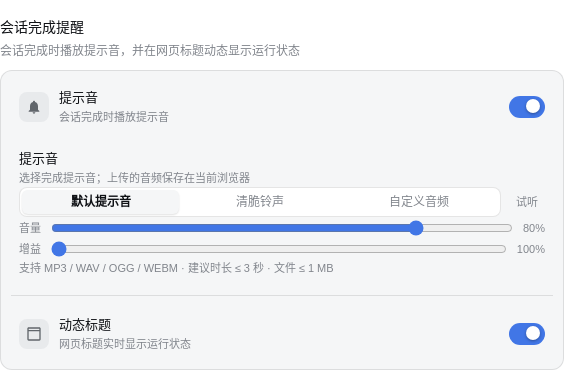

# dsh-mods-enhanced — 增强功能静态化常驻包(替代 5 个动态插件)

将 baln-4 / sntf-5 / tokm-1 / cost-6 四个动态插件**合并**为一个
**profile 静态插件**,随 dsh web 服务启动自动加载,不再需要 cordis_define/cordis_run。

> 2026-08 适配 dsh 0.1.1-rc.1:**imgr-3 粘贴图片转文字已移除**(0.1.1 起官方
> 原生支持多模态,`deepseek-v4-flash-vision-exp` 可直接看图);对话**折叠功能**
> 也已随 0.1.1 补丁重建一并舍弃。

## 效果预览

> 截图均为演示数据(金额/会话标题已替换或打码),不包含真实信息。

| 功能 | 截图 |
|---|---|
| 会话统计栏(费用 + Token 用量) |  |
| 总账单页 |  |
| 费用预估设置卡 |  |
| 账单货币卡 |  |
| 会话完成提醒设置卡 |  |
| 账户余额(打码) |  |

## 常驻原理

- 包位于 `~/.dsh/profiles/web/plugins/dsh-mods-enhanced/`
- `web/package.json` dependencies 声明 `"dsh-mods-enhanced": "file:plugins/dsh-mods-enhanced"`
- `web/cordis.patch.yml` insert 插件行(与 dsh-tool-see-image 同模式)
- Host 半:`TypertRemoteService` + 手动 Remote 标记(无构建管线,模拟 @Remote 装饰器)
- Client 半:`dsh.client` 声明 + `__ModuleLoader__` 格式(免编译,dsh-client-modules 直接加载)
- 通信:`ctx.remote.enhanced.<method>(sessionId, args)`;会话状态/用量等
  通过 Remote 轮询(useProjection/useSessions 的 API 差异风险已规避)

## 与动态插件的对应

| 动态插件 | 静态包内 |
|---|---|
| tokm-1 投影注册 | constructor: sessionProjections.register |
| sntf-5 agent/status | constructor: ctx.on('agent/status') + Remote notifyState |
| baln-4 balance | Remote balance |
| cost-6 折叠引擎 | Remote costSession/costAll/costConfig/currencyRates + usageByModel |

## 生效方式

- **一键安装(推荐)**: `bash scripts/install.sh`(仓库根目录)——自动安装 dsh 0.1.1-rc.1、
  把本包装入 `~/.dsh/profiles/web/plugins/`、应用 `patches/ui-conversation.patch` +
  `patches/dsh-host-apiproxy-0.1.1.patch`(或 `scripts/reapply-dsh-mods.sh`)并配置
  `package.json` + `cordis.patch.yml`;
- 手动:把本目录复制到 `~/.dsh/profiles/web/plugins/dsh-mods-enhanced/`,按
  `web/package.json` dependencies + `cordis.patch.yml` insert 配置。

修改 profile 后需**重启服务**:
`bash ~/.dsh/scripts/restart-dsh-web.sh`
重启后插件自动常驻;动态插件(进程内)随之清空,无需再手动启动。

## 回退

删除 `cordis.patch.yml` 中对应 insert 行即可禁用(保留文件,随时可恢复)。
